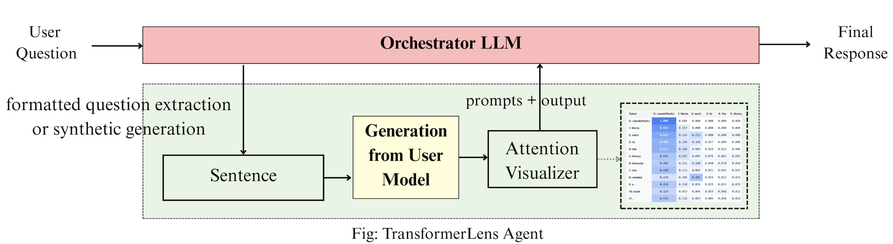
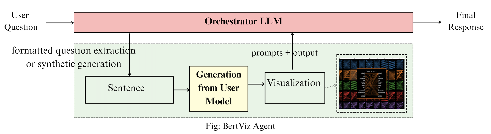
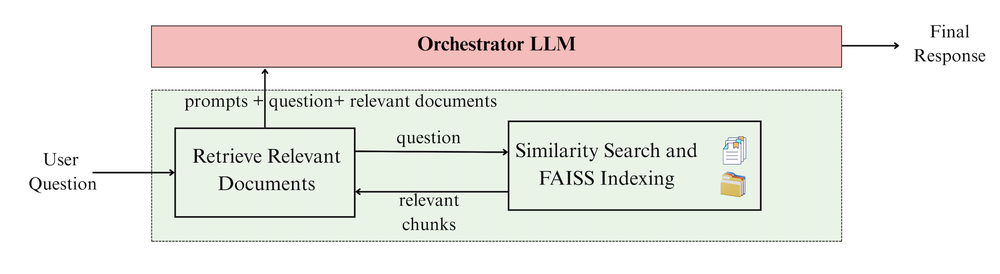
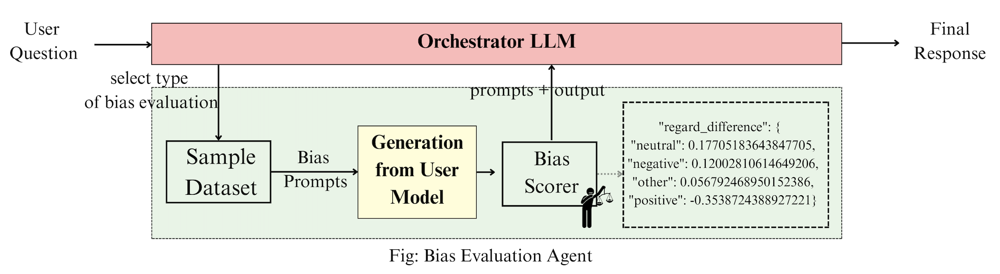

[](https://opensource.org/licenses/MIT)

# Overview
## [▶ Watch the demo video](https://streamable.com/l88z0p)
## [▶ Live Demo ](http://34.229.129.135:4173)

KnowThyself helps students, engineers, and researchers explore how language models work. Users upload a model, ask natural-language questions, and receive interactive visualizations with grounded explanations. A supervisor LLM routes tasks to modular tool agents (TransformerLens, BertViz, Bias Evaluator), while a RAG component cites relevant interpretability literature. The system supports local deployment (e.g., Ollama) and common open-model families (e.g., GPT-2, Llama).

<!--  -->


<!-- Anonymous Code: https://anonymous.4open.science/r/KnowThyself -->

## Motivation 🧠
Interpretability tools are powerful but often scattered and code-intensive. KnowThyself provides:
- a single conversational entrypoint for multiple interpretability methods,
- grounded (citation-aware) explanations for learning and review,
- a modular design that welcomes new tools without breaking existing ones.

## Core Features 💡

- ⚙️ Agentic orchestration with LangGraph (routing + summarization).
- 🔎 TransformerLens (HookedTransformer): attention heads/layers, interventions.
- 👁️ BertViz model view (HF output_attentions=True) for attention visualization.
- 📚 RAG-grounded explanations using interpretability papers/docs.
- 🧪 Bias evaluation: toxicity, regard, HONEST (extensible datasets & metrics).
- 🧩 Modular tool agents: drop in/out new tools with minimal coupling.
- 🖥️ Chat UI with interactive visualizations and image-based explanations.
- 🏠 Local-friendly (Ollama) and cloud-agnostic configuration.

## Architecture 🧭

### Orchestrator LLM (Supervisor)
Routes user queries to agents (embedding/RAG + direct prediction), then explains results in plain language.

### Tool Agents

#### TransformerLens Agent 


 The TransformerLens agent is responsible for mechanistic interpretability at the token, head, and layer level. When invoked, it loads the selected model through the HookedTransformer interface and runs targeted inspections such as visualizing attention patterns, intervening on activations, or performing activation patching experiments. For example, it can ablate a specific head to test its importance, or swap hidden states between prompts to reveal causal circuits like induction heads. The agent outputs structured visualizations (e.g., attention heatmaps) along with numerical summaries such as logit-difference scores. These results are then passed back to the Orchestrator, which explains them in natural language, making low-level analyses intelligible to non-expert users.


#### BertViz Agent — attention visualization (HF model + tokenizer)

The BertViz agent focuses on interactive visualization of attention across layers and heads. When the Orchestrator routes a query about “how the model attends,” this agent tokenizes the input, extracts attention weights from the model, and renders them in intuitive formats such as head-view or model-view grids. Users can explore which tokens attend to which others, compare attention across heads, and trace long-range dependencies in sentences.
Although the raw visualizations can be dense, the Orchestrator pairs them with guided explanations that highlight patterns, such as which heads focus on syntactic structure or coreference resolution. This agent therefore lowers the barrier to inspecting the distributed focus of large models.

#### RAG Explainer — retrieves/cites relevant literature

The RAG Explainer agent grounds interpretability results in the broader literature. When a user asks “why does this happen?” or seeks context for a visualization, the agent retrieves relevant documents from a curated library of explainable AI papers and interpretability resources. It then synthesizes these references into concise explanations that accompany the tool output, ensuring results are not only descriptive but also connected to prior research. 

#### BiasEval Agent — toxicity, regard, HONEST scoring
The Bias Evaluator agent operationalizes fairness analysis by probing models with benchmark datasets. It uses prompts from sources such as Real Toxicity Prompts (for abusive language), BOLD (for demographic framing across gender, race, and ideology), and HONEST (for hurtful lexical completions). Model continuations are generated and then scored against three metrics: toxicity (detecting harmful speech), regard (sentiment polarity toward groups), and HONEST (frequency of biased or hurtful completions). The agent aggregates these results into interpretable statistics, such as toxicity ratios or average regard differences between demographic groups. These outputs allow users to directly assess whether their model behaves unevenly or risks producing unsafe content, with the Orchestrator translating numerical scores into accessible insights.


### User Interface
Web chat + interactive views. Users can upload models, run tasks, and inspect results without writing code.

---

## Installation (pyproject.toml) ⚙️

**Requires Python ≥ 3.10.**

### 1) Create & activate a virtual environment

```bash
python -m venv .venv
source .venv/bin/activate  # Windows: .venv\Scripts\activate
python -m pip install --upgrade pip
```

### 2) Install from the repo root

```bash
pip install -e .
```

### Local LLMs with Ollama
To setup Ollama locally, install & start it first: https://ollama.ai

---
## Quick Start 🍏

### Configure environment

```bash
export DEPLOYEMENT_TYPE=ollama             # or "openai"
export ORCHESTRATOR_LLM=gemma3:27b          # e.g., "llama3" or "gpt-4o-mini"
export GPT_USER_MODEL=gpt2-small             # default user model name
# export OPENAI_API_KEY=sk-...            # only if using OpenAI
```

---
### Add New Tools
View the docs to understand how to add new tools.
[View Tool Setup](assets/add_new_tools.pdf)
## Typical Tasks 🎯

### Attention visualization
“Show me how the model attends across tokens for the word ‘she’ in a sentence.”
→ TransformerLens Agent renders a heatmap + natural-language explanation.

### Bias evaluation
> “Does my model show gender bias in how it answers questions?”  
→ Bias Evaluator samples prompts (e.g., Real Toxicity Prompts, BOLD, HONEST), runs the model, and summarizes scores.

---

## Roadmap 🗺️

- Add more interpretability tools (activation patching, causal tracing)
- Expand to multimodal (vision) models
- Finer routing for overlapping tasks
- Richer visualization exports & classroom tutorials

---

## License
Licensed under the [MIT License](LICENSE).

---

## Acknowledgements

- [TransformerLens / HookedTransformer](https://github.com/neelnanda-io/TransformerLens)
- [BertViz](https://github.com/jessevig/bertviz)
- [LangGraph](https://github.com/langchain-ai/langgraph)
- [Ollama](https://ollama.ai)
- [Hugging Face Transformers](https://github.com/huggingface/transformers)

---