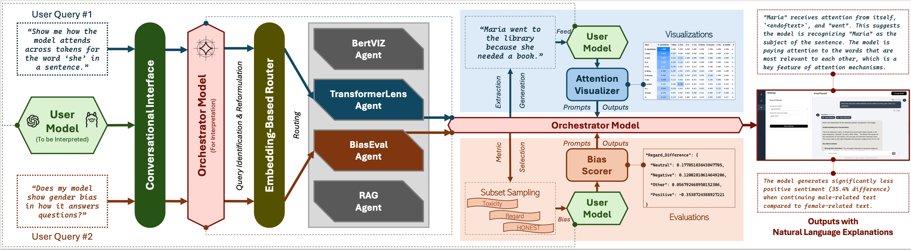

[](https://opensource.org/licenses/MIT)

Overview
KnowThyself helps students, engineers, and researchers explore how language models work. Users upload a model, ask natural-language questions, and receive interactive visualizations with grounded explanations. A supervisor LLM routes tasks to modular tool agents (TransformerLens, BertViz, Bias Evaluator), while a RAG component cites relevant interpretability literature. The system supports local deployment (e.g., Ollama) and common open-model families (e.g., GPT-2, Llama).

<!--  -->


Live Demo: http://34.229.129.135:4173
<!-- Anonymous Code: https://anonymous.4open.science/r/KnowThyself -->

## Motivation 🧠
Interpretability tools are powerful but often scattered and code-intensive. KnowThyself provides:
- a single conversational entrypoint for multiple interpretability methods,
- grounded (citation-aware) explanations for learning and review,
- a modular design that welcomes new tools without breaking existing ones.

## Core Features 💡

- ⚙️ Agentic orchestration with LangGraph (routing + summarization).
- 🔎 TransformerLens (HookedTransformer): attention heads/layers, interventions.
- 👁️ BertViz model view (HF output_attentions=True) for attention visualization.
- 📚 RAG-grounded explanations using interpretability papers/docs.
- 🧪 Bias evaluation: toxicity, regard, HONEST (extensible datasets & metrics).
- 🧩 Modular tool agents: drop in/out new tools with minimal coupling.
- 🖥️ Chat UI with interactive visualizations and image-based explanations.
- 🏠 Local-friendly (Ollama) and cloud-agnostic configuration.

## Architecture 🧭

### Orchestrator LLM (Supervisor)
Routes user queries to agents (embedding/RAG + direct prediction), then explains results in plain language.

### Tool Agents

- TransformerLens Agent — attention patterns & interventions
- BertViz Agent — attention visualization (HF model + tokenizer)
- RAG Explainer — retrieves/cites relevant literature
- Bias Evaluator — toxicity, regard, HONEST scoring

### User Interface
Web chat + interactive views. Users can upload models, run tasks, and inspect results without writing code.

---

## Installation (pyproject.toml) ⚙️

**Requires Python ≥ 3.10.**

### 1) Create & activate a virtual environment

```bash
python -m venv .venv
source .venv/bin/activate  # Windows: .venv\Scripts\activate
python -m pip install --upgrade pip
```

### 2) Install from the repo root

```bash
pip install -e .
```

### Local LLMs with Ollama
To setup Ollama locally, install & start it first: https://ollama.ai

---
## Quick Start 🍏

### Configure environment

```bash
export DEPLOYEMENT_TYPE=ollama             # or "openai"
export ORCHESTRATOR_LLM=gemma3:27b          # e.g., "llama3" or "gpt-4o-mini"
export GPT_USER_MODEL=gpt2-small             # default user model name
# export OPENAI_API_KEY=sk-...            # only if using OpenAI
```

---

## Typical Tasks 🎯

### Attention visualization
“Show me how the model attends across tokens for the word ‘she’ in a sentence.”
→ TransformerLens Agent renders a heatmap + natural-language explanation.

### Bias evaluation
> “Does my model show gender bias in how it answers questions?”  
→ Bias Evaluator samples prompts (e.g., Real Toxicity Prompts, BOLD, HONEST), runs the model, and summarizes scores.

---

## Roadmap 🗺️

- Add more interpretability tools (activation patching, causal tracing)
- Expand to multimodal (vision) models
- Finer routing for overlapping tasks
- Richer visualization exports & classroom tutorials

---

## License
Licensed under the [MIT License](LICENSE).

---

## Acknowledgements

- [TransformerLens / HookedTransformer](https://github.com/neelnanda-io/TransformerLens)
- [BertViz](https://github.com/jessevig/bertviz)
- [LangGraph](https://github.com/langchain-ai/langgraph)
- [Ollama](https://ollama.ai)
- [Hugging Face Transformers](https://github.com/huggingface/transformers)

---